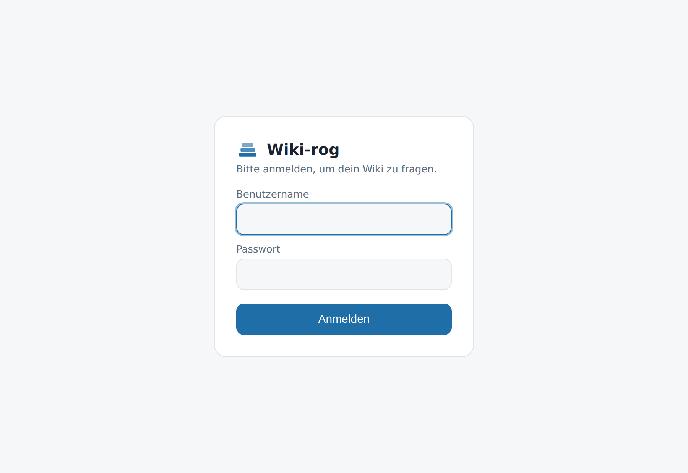
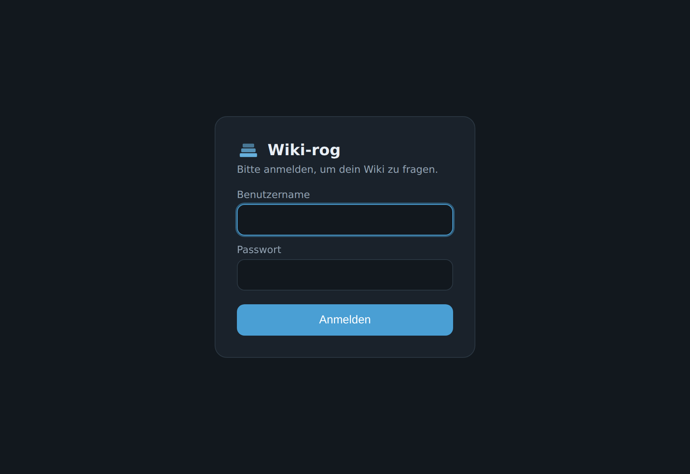
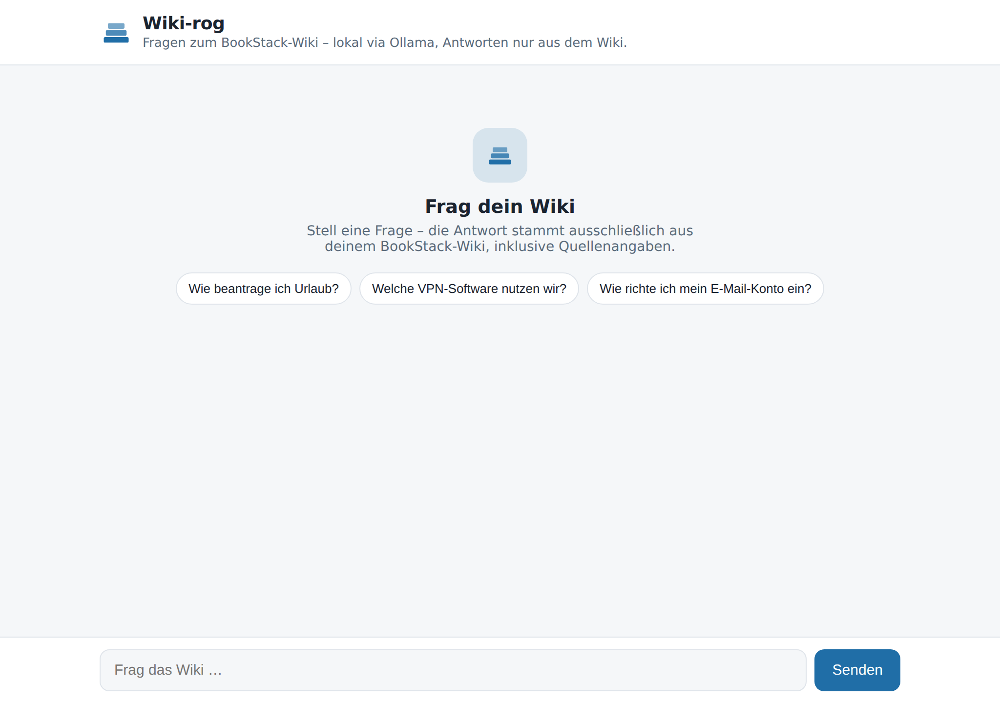
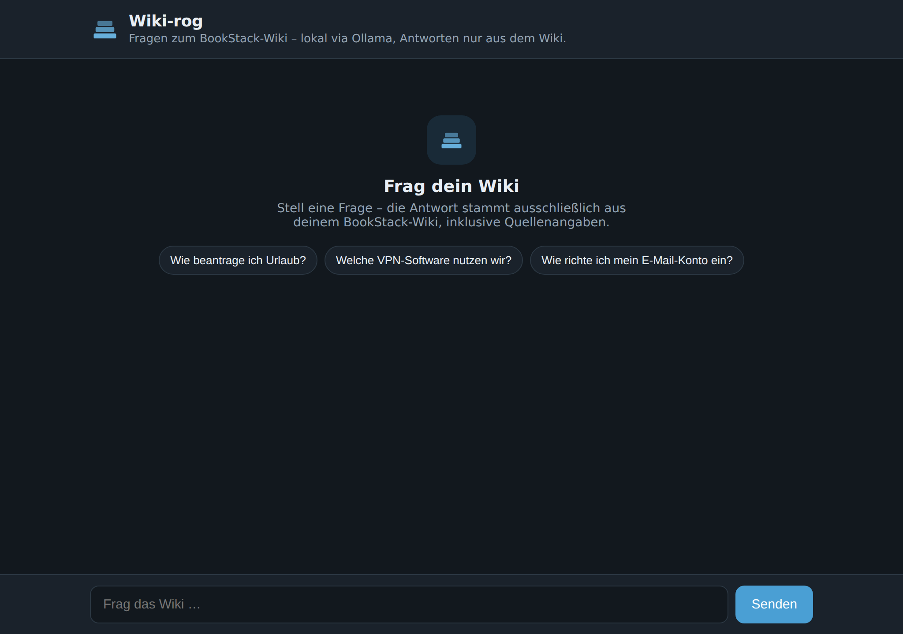
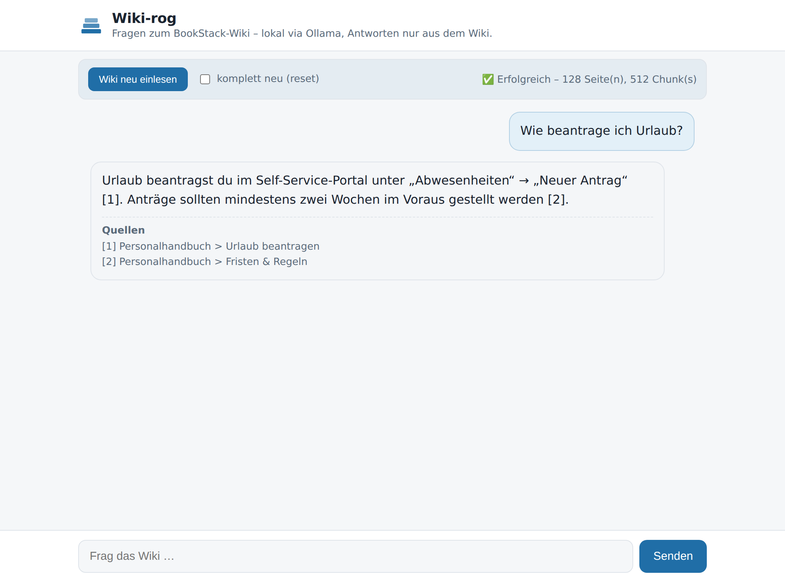
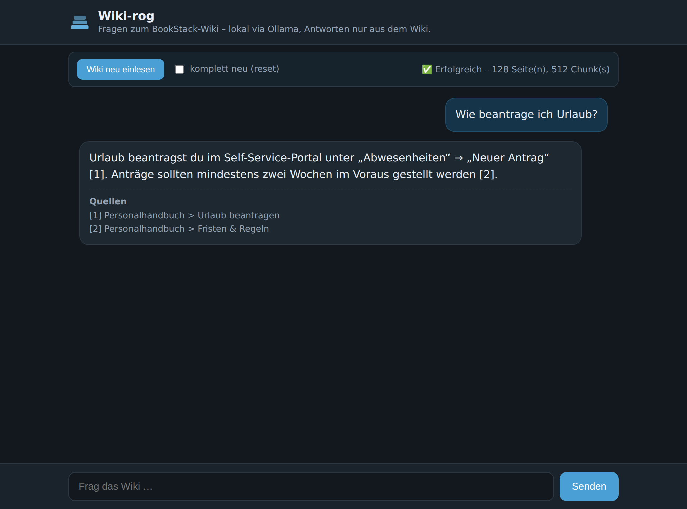

# 📚 Wiki-rog

Ein **lokales RAG-System** (Retrieval-Augmented Generation) in **Go**, das
ausschließlich das Wissen aus einem **externen BookStack-Wiki** nutzt. Antworten
und Embeddings laufen lokal über [Ollama](https://ollama.com) – es verlassen
keine Daten den Server (außer den API-Aufrufen an dein eigenes Wiki).

- **Sprache:** Go (nur Standardbibliothek, keine externen Module)
- **Datenquelle:** BookStack REST-API (nur diese Inhalte werden „gelernt")
- **Embeddings & LLM:** lokal via Ollama (kleines CPU-Modell, kein GPU nötig)
- **Vektorspeicher:** umschaltbar – **`local`** (eingebettet, pure Go) oder **`qdrant`**
- **Antworten:** strikt nur aus dem abgerufenen Wiki-Kontext – sonst
  „Das steht nicht im Wiki."

```
BookStack ──REST──> Ingest ──Chunks──> Embeddings (Ollama) ──> Vektorspeicher
                                                                     │
Frage ──> Embedding ──> Ähnlichkeitssuche ──> Kontext ──> LLM (Ollama) ──> Antwort + Quellen
```

## Screenshots

Die Web-UI (`wiki-rog serve`) – schlichter Chat im BookStack-Blau, Antworten mit
Quellenangaben, Hell-/Dunkelmodus je nach System, responsiv bis Smartphone-Breite.

| Login (hell) | Login (dunkel) |
|---|---|
|  |  |

| Startzustand (hell) | Startzustand (dunkel) |
|---|---|
|  |  |

| Admin-Leiste „Wiki neu einlesen" (hell) | Admin-Leiste (dunkel) |
|---|---|
|  |  |

| Desktop (dunkel) | Desktop (hell) |
|---|---|
|  |  |

| Mobil (hell) | Mobil (dunkel) |
|---|---|
|  |  |

## Warum „lernt" es nur BookStack-Daten?

Das Modell wird **nicht** trainiert. Bei jeder Frage wird relevanter Text aus dem
Wiki gesucht und dem LLM als Kontext mitgegeben. Der System-Prompt zwingt das
Modell, **nur** aus diesem Kontext zu antworten und kein Weltwissen zu verwenden.
So bleibt die Wissensbasis exakt auf BookStack beschränkt und ist jederzeit
aktuell (einfach neu indexieren).

## Voraussetzungen

1. **Go 1.24+** (zum Bauen)
2. **Ollama** installiert und gestartet (`ollama serve`), mit den Modellen:
   ```bash
   ollama pull llama3.2:1b       # kleines, CPU-taugliches Antwort-Modell
   ollama pull nomic-embed-text  # Embedding-Modell
   ```
3. Eine erreichbare **BookStack-Instanz** (extern) mit API-Token
   (BookStack → *Profil bearbeiten* → *API-Tokens*).

## Bauen & Nutzen (lokal)

```bash
cp .env.example .env      # BookStack-URL + Token eintragen
go build -o wiki-rog ./cmd/wiki-rog

./wiki-rog test           # Verbindungen prüfen (BookStack + Ollama)
./wiki-rog ingest         # Wiki indexieren (inkrementell)
./wiki-rog ingest --reset # kompletter Neuaufbau
./wiki-rog ask "Wie beantrage ich Urlaub?"
./wiki-rog chat           # interaktiver Chat im Terminal
./wiki-rog serve          # Web-UI auf http://localhost:8080
```

Tests:
```bash
go test ./...
```

### Wiki anlernen (indexieren)

„Anlernen" = die BookStack-Inhalte **indexieren**. Drei Wege — ausführlich in
**[docs/ANLEITUNG-LERNEN.md](docs/ANLEITUNG-LERNEN.md)**:

1. **Admin-Button in der WebUI** – Admins sehen oben die Leiste
   **„Wiki neu einlesen"** (mit Option „komplett neu (reset)"). Läuft im
   Hintergrund mit Live-Status. Admin = Nutzer mit `"admin": true` in
   `access.json` (bzw. `OPEN_ADMIN=true` im offenen Modus).
2. **CLI:** `./wiki-rog ingest` bzw. `./wiki-rog ingest --reset`.
3. **Kubernetes-Job:** `k8s/ingest-job.yaml` (einmalig) oder
   `k8s/ingest-cronjob.yaml` (täglich), gruppenweise via `k8s/ingest-groups-example.yaml`.

## Vektorspeicher: `local` oder `qdrant`

Umschaltbar über `VECTOR_BACKEND`:

- **`local`** (Standard) – eingebettet, pure Go. Speichert Embeddings in einer
  Datei unter `STORE_DIR` und sucht per In-Memory-Cosine-Ähnlichkeit. Kein
  zusätzlicher Dienst, ideal für Wiki-Größen (tausende Chunks).
- **`qdrant`** – nutzt einen externen [Qdrant](https://qdrant.tech)-Dienst über
  HTTP (`QDRANT_URL`). Skaliert besser für sehr große Wikis.

Nach einem Backend-Wechsel einmal `ingest --reset` ausführen.

## Konfiguration (`.env` bzw. Umgebungsvariablen)

| Variable | Bedeutung | Default |
|---|---|---|
| `BOOKSTACK_URL` | Basis-URL des externen Wikis | – |
| `BOOKSTACK_TOKEN_ID` / `BOOKSTACK_TOKEN_SECRET` | API-Token | – |
| `BOOKSTACK_BOOK_IDS` / `BOOKSTACK_SHELF_IDS` | Filter (kommagetrennt) | alle |
| `BOOKSTACK_VERIFY_SSL` | TLS-Prüfung des Wikis | `true` |
| `OLLAMA_URL` | Ollama-Endpoint | `http://localhost:11434` |
| `OLLAMA_LLM_MODEL` | Antwort-Modell | `llama3.2:1b` |
| `OLLAMA_EMBED_MODEL` | Embedding-Modell | `nomic-embed-text` |
| `VECTOR_BACKEND` | `local` oder `qdrant` | `local` |
| `VECTOR_COLLECTION` | Name der Collection/Datei | `bookstack` |
| `STORE_DIR` | Speicherort (Backend `local`) | `./data/store` |
| `QDRANT_URL` / `QDRANT_API_KEY` | Qdrant-Endpoint (Backend `qdrant`) | `http://qdrant:6333` |
| `CHUNK_SIZE` / `CHUNK_OVERLAP` | Chunk-Größe/Überlappung (Zeichen) | `1000` / `150` |
| `RETRIEVAL_TOP_K` | Anzahl Kontext-Chunks je Frage | `5` |
| `RETRIEVAL_MAX_DISTANCE` | max. Cosine-Distanz für Treffer | `1.0` |
| `HTTP_ADDR` | Adresse der Web-UI (`serve`) | `:8080` |

Private CA: `SSL_CERT_FILE` auf das CA-Bundle setzen (Go liest diese Variable).

## Deployment auf einem VPS (Docker Compose)

Für einen einzelnen Server ist Docker Compose der einfachste Weg – Ollama +
WebUI + Ingest in einer Datei (`docker-compose.yml`).

```bash
# 1) Konfiguration
cp .env.example .env            # BookStack-URL + Token eintragen
#    (für Login/Admin zusätzlich config/access.json anlegen, s. u.)

# 2) Ollama starten und Modelle laden (einmalig)
docker compose up -d ollama
docker compose run --rm model-init

# 3) Wiki indexieren
docker compose run --rm ingest --reset

# 4) WebUI starten
docker compose up -d app
#    -> standardmäßig auf 127.0.0.1:8080 (hinter Reverse-Proxy).
#    Direkt erreichbar: in .env  APP_BIND=0.0.0.0  setzen.
```

Nützliche Befehle:
```bash
docker compose logs -f app                 # Logs
docker compose run --rm ingest             # inkrementell neu einlesen
docker compose run --rm app hashpw 'pw'    # Passwort-Hash erzeugen
docker compose pull && docker compose up -d --build   # aktualisieren
```

**Persistenz:** Modelle liegen im Volume `ollama_models`, der Vektorindex in
`store_data` – beide überleben Neustarts/Updates.

**Login/Admin (optional):** `config/access.json` anlegen (siehe
`config/access.example.json`) und in `.env` ein `SESSION_SECRET` setzen; danach
`docker compose up -d app`. Ohne `access.json` läuft die WebUI offen.

**Sicherheit auf dem VPS:** Am besten die WebUI nur lokal binden
(`APP_BIND=127.0.0.1`, Standard) und einen Reverse-Proxy (Caddy/Traefik/nginx)
mit TLS davorsetzen; dann in `.env` `SESSION_SECURE=true`. Ollama ist in Compose
nicht nach außen exponiert (nur `expose`, kein `ports`).

## Deployment auf Kubernetes

Der komplette Stack (Ollama mit kleinem CPU-Modell, Web-UI, Ingest) läuft im
Cluster – **ohne GPU**. Das BookStack-Wiki bleibt **extern**. Manifeste: `k8s/`.

**1) Image bauen und dem Cluster verfügbar machen**
```bash
docker build -t wiki-rog:latest .

# Beispiel minikube:      minikube image load wiki-rog:latest
# Beispiel kind:          kind load docker-image wiki-rog:latest
# Registry (Produktion):  docker tag wiki-rog:latest <registry>/wiki-rog:latest
#                         docker push <registry>/wiki-rog:latest
#     (dann image: in k8s/app.yaml & k8s/ingest-job.yaml anpassen)
```

**2) Konfiguration & Secret setzen**
```bash
# BOOKSTACK_URL usw. in k8s/configmap.yaml anpassen
cp k8s/secret.example.yaml k8s/secret.yaml   # echte Token eintragen (gitignored)
```

**3) Ausrollen**
```bash
kubectl apply -f k8s/namespace.yaml
kubectl apply -f k8s/secret.yaml
kubectl apply -k k8s/                        # Ollama, App, Ingest-Job, Modell-Pull

kubectl -n wiki-rog wait --for=condition=complete job/ollama-pull-models --timeout=1200s
kubectl -n wiki-rog rollout status deploy/wiki-rog-app
```

**4) Web-UI öffnen**
```bash
kubectl -n wiki-rog port-forward svc/wiki-rog-app 8080:80
# -> http://localhost:8080
```

**Optional**
- `kubectl apply -f k8s/ingress.yaml` – Ingress (host/ingressClassName anpassen)
- `kubectl apply -f k8s/ingest-cronjob.yaml` – tägliche Auto-Aktualisierung
- `kubectl apply -f k8s/networkpolicy.yaml` – **Netzwerk-Isolation** (siehe unten)
- `kubectl apply -f k8s/qdrant.yaml` – Qdrant-Backend (danach `VECTOR_BACKEND=qdrant`)

**Kleines CPU-Modell:** Standard ist `llama3.2:1b` (~1,3 GB) + `nomic-embed-text`.
Andere Modelle in `k8s/configmap.yaml` (`OLLAMA_LLM_MODEL`) setzen und den
`ollama-pull-models`-Job erneut ausführen. Für Ollama sind bewusst **keine**
GPU-Ressourcen angefordert – reiner CPU-Betrieb.

### Externes Wiki (außerhalb des Clusters)

Das BookStack-Wiki wird **nicht** im Cluster betrieben. Benötigt wird nur die
externe URL (`BOOKSTACK_URL`) + Token (`wiki-rog-secret`). Der Ingest-Job holt
die Inhalte per HTTPS live von dort.

- **Egress:** Ingest-Job/App müssen nach außen (Port 443) dürfen. Bei
  Default-Deny: `kubectl apply -f k8s/networkpolicy.yaml`. Liegt das Wiki in
  einem **privaten Netz**, den `except`-Block der Policy anpassen.
- **Öffentliches Zertifikat:** funktioniert ohne weitere Einstellungen.
- **Private CA:** CA als ConfigMap mounten und `SSL_CERT_FILE` setzen.
- **Self-signed (Notlösung):** `BOOKSTACK_VERIFY_SSL: "false"`.

Verbindungstest aus dem Cluster:
```bash
kubectl -n wiki-rog run bs-test --rm -it --restart=Never \
  --image=wiki-rog:latest --command -- /app/wiki-rog test
```

### Sicherheit: Ollama abschotten (Netzwerk-Isolation)

`k8s/networkpolicy.yaml` schottet den Namespace per **Default-Deny** ab und gibt
nur das Nötigste frei. Damit gilt:

- **Ollama sendet nichts nach außen.** Der Ollama-Server hat **keinerlei Egress**
  (nicht mal DNS) – er kann keine Wiki-Inhalte oder Prompts nach außen schicken.
- **Ollama holt nur sein Modell – entkoppelt.** Der Modell-Download läuft nicht
  über den produktiven Server, sondern über den kurzlebigen Job
  `ollama-pull-models`, der die Modelle in ein PVC schreibt. **Nur dieser Pod**
  darf ins Internet (`ollama-pull-egress`); danach liest der Server die Modelle
  nur noch von der Platte.
- **Ollama antwortet nur intern.** Erreichbar ist Ollama (Port 11434)
  ausschließlich vom App-Pod (WebUI) und vom Ingest-Job – nie von außen.
- **Ingest** darf nach außen nur zum externen Wiki (443/80), **App** nur zur
  WebUI (eingehend 8080) und intern zu Ollama/Qdrant, **Qdrant** hat keinen Egress.

| Komponente | Eingehend | Ausgehend |
|---|---|---|
| Ollama (serving) | App, Ingest (11434) | **nichts** |
| ollama-pull (Job) | – | Internet 443/80 (nur Modell-Download) |
| App / WebUI | alle (8080) | Ollama, Qdrant (intern) + DNS |
| Ingest | – | Ollama, Qdrant, externes Wiki (443/80) + DNS |
| Qdrant (optional) | App, Ingest (6333) | **nichts** |

Anwenden (idempotent, in einem Rutsch – Default-Deny + alle Freigaben):
```bash
kubectl apply -f k8s/networkpolicy.yaml
```

Hinweise:
- **CNI-Voraussetzung:** Es braucht eine NetworkPolicy-durchsetzende CNI
  (Calico, Cilium, …). Ohne Durchsetzung (z. B. Flannel) haben die Regeln keine
  Wirkung. Prüfen z. B. mit einem Test-Pod, ob Ollamas Egress wirklich blockiert.
- **Shared PVC:** `ollama-pull-models` und der Ollama-Server teilen sich das
  `ollama-models`-PVC (ReadWriteOnce). Im Einzelknoten-Cluster unkritisch; bei
  mehreren Knoten sollten beide auf demselben Knoten laufen (oder RWX nutzen).
- **Noch strenger (nur Cilium):** Statt „nur der Pull-Pod darf ins ganze
  Internet" lässt sich mit einer `CiliumNetworkPolicy` per `toFQDNs` gezielt nur
  `registry.ollama.ai` freigeben. Sag Bescheid, dann liefere ich die Variante.

### Dev-Zugang über WireGuard (VPN)

Für den **Dev-Betrieb** kannst du die WebUI über deinen bestehenden
WireGuard-VPN erreichbar machen – ohne Ingress/LoadBalancer/port-forward.
`k8s/wireguard.yaml` startet einen Pod, der sich als **Client** mit deinem
VPN-Server verbindet und den Tunnel-Port 8080 an den `wiki-rog-app`-Service
weiterleitet (WireGuard-Container + socat).

```bash
# 1) Client-Config als Secret anlegen (privater Key, Server-Endpoint, Tunnel-IP)
cp k8s/wireguard-secret.example.yaml k8s/wireguard-secret.yaml   # ausfüllen
kubectl apply -f k8s/wireguard-secret.yaml

# 2) VPN-Gateway starten
kubectl apply -f k8s/wireguard.yaml
kubectl -n wiki-rog logs deploy/wireguard -c wireguard   # Handshake prüfen
```

Danach von einem **anderen Gerät im selben VPN**:
```
http://<CLIENT-TUNNEL-IP>:8080      # z. B. http://10.13.13.2:8080
```

Wichtig:
- Auf deinem **VPN-Server** muss der `AllowedIPs`-Eintrag dieses Clients dessen
  Tunnel-IP enthalten, damit andere Peers ihn (und die WebUI) erreichen.
- Der WireGuard-Container läuft **privilegiert** – das ist bewusst nur für den
  Dev-Betrieb gedacht; nicht für Produktion verwenden.
- Bei aktiver Netzwerk-Isolation deckt `wireguard-netpol` (in
  `k8s/networkpolicy.yaml`) den nötigen Egress ab.
- Der WireGuard-Kernelmodul muss auf dem Node vorhanden sein (Kernel ≥ 5.6).

### Zugriffsrechte: gruppenbasiertes Login (wie BookStack)

Damit Nutzer nur die Inhalte sehen, für die sie berechtigt sind, gibt es ein
**gruppenbasiertes Modell mit Login**:

1. **Pro Gruppe eine Collection**, indexiert mit einem **eigenen BookStack-Token**
   einer passend berechtigten Rolle. Da BookStack über die API nur erlaubte
   Inhalte liefert, enthält jede Collection ausschließlich die für die Gruppe
   sichtbaren Seiten. → Die Rechte bleiben in BookStack, werden nicht nachgebaut.
2. **Login (Nutzer/Passwort)** in der WebUI. Jeder Nutzer ist Gruppen zugeordnet
   und bekommt Antworten **nur** aus den Collections seiner Gruppen.
3. Passwörter als **PBKDF2-Hash** (Go-Standardbibliothek), Session als signiertes
   Cookie (HMAC). Ohne Access-Konfiguration läuft die WebUI **offen** (kein Login).

**Einrichten (lokal):**
```bash
# Passwort-Hash je Nutzer erzeugen
./wiki-rog hashpw 'MeinPasswort'
# config/access.example.json -> config/access.json kopieren, Hashes + Gruppen eintragen
export SESSION_SECRET="$(openssl rand -hex 32)"
# Pro Gruppe mit dem jeweiligen Token indexieren:
BOOKSTACK_TOKEN_ID=... BOOKSTACK_TOKEN_SECRET=... VECTOR_COLLECTION=bookstack-it ./wiki-rog ingest --reset
BOOKSTACK_TOKEN_ID=... BOOKSTACK_TOKEN_SECRET=... VECTOR_COLLECTION=bookstack-hr ./wiki-rog ingest --reset
./wiki-rog serve   # WebUI verlangt jetzt Login
```

**Einrichten (Kubernetes):**
```bash
# 1) Access-Secret (Login + Gruppen -> Collection) anlegen
cp k8s/access-secret.example.yaml k8s/access-secret.yaml   # Hashes/SESSION_SECRET eintragen
kubectl apply -f k8s/access-secret.yaml
kubectl -n wiki-rog rollout restart deploy/wiki-rog-app     # aktiviert das Login

# 2) Pro Gruppe ein BookStack-Token-Secret + Ingest-Job (siehe Datei)
kubectl -n wiki-rog create secret generic wiki-rog-token-it  --from-literal=BOOKSTACK_TOKEN_ID=... --from-literal=BOOKSTACK_TOKEN_SECRET=...
kubectl -n wiki-rog create secret generic wiki-rog-token-hr  --from-literal=BOOKSTACK_TOKEN_ID=... --from-literal=BOOKSTACK_TOKEN_SECRET=...
kubectl apply -f k8s/ingest-groups-example.yaml
```

`access.json`-Format (Gruppen → Collection, Nutzer → Gruppen):
```json
{
  "groups": { "it": {"collection": "bookstack-it"}, "hr": {"collection": "bookstack-hr"} },
  "users":  [ {"username": "bob", "password_hash": "pbkdf2_sha256$...", "groups": ["it"]} ]
}
```

Hinweise:
- Die Granularität entspricht **deinen Gruppen** (nicht seitengenau pro Nutzer).
  Für exakte Pro-Nutzer-Rechte wie in BookStack wäre Modell A (persönliches
  Token je Nutzer) nötig – sag Bescheid, dann ergänze ich es.
- Hinter HTTPS `SESSION_SECURE=true` setzen (Secure-Flag am Cookie).

## Projektstruktur

```
Wiki-rog/
├── cmd/wiki-rog/main.go       # CLI: test / ingest / ask / chat / serve
├── internal/
│   ├── config/                # Konfiguration aus Umgebung/.env
│   ├── bookstack/             # BookStack REST-API-Client
│   ├── chunk/                 # Text-Chunking (+ Tests)
│   ├── ollama/                # Ollama (Embeddings + Chat, Streaming)
│   ├── store/                 # Vektorspeicher: Interface + local + qdrant (+ Tests)
│   ├── auth/                  # Login, Gruppen→Collection, PBKDF2, Sessions (+ Tests)
│   ├── rag/                   # Retrieval (mehrere Collections) + Antwortgenerierung
│   ├── ingest/               # Pipeline: fetch → chunk → embed → store
│   ├── admin/                 # Reindex-Runner für den WebUI-Admin-Button
│   └── webui/                 # HTTP-Server + Chat-UI + Login + Admin (SSE)
├── config/access.example.json # Vorlage für Login/Gruppen
├── docs/ANLEITUNG-LERNEN.md   # Anleitung zum Indexieren (inkl. Admin-Button)
├── go.mod
├── Dockerfile                 # Multi-Stage Go-Build (distroless)
├── docker-compose.yml         # VPS-Deployment (Ollama + WebUI + Ingest)
├── .env.example
└── k8s/                       # Kubernetes-Manifeste
    ├── kustomization.yaml
    ├── namespace.yaml
    ├── configmap.yaml         # Konfiguration + Backend-/Modellwahl
    ├── secret.example.yaml    # Vorlage für BookStack-Token
    ├── access-secret.example.yaml   # Vorlage: Login/Gruppen + SESSION_SECRET
    ├── ingest-groups-example.yaml   # gruppenweise Indexierung (je Token/Collection)
    ├── storage.yaml           # PVC für local-Backend
    ├── ollama.yaml            # Ollama-Deployment (CPU-only) + Service + PVC
    ├── ollama-pull-job.yaml   # lädt die Modelle in Ollama
    ├── app.yaml               # Web-UI Deployment + Service
    ├── ingest-job.yaml        # einmaliger Ingest
    ├── ingest-cronjob.yaml    # optionale Auto-Aktualisierung
    ├── qdrant.yaml            # optionales Qdrant-Backend
    ├── networkpolicy.yaml     # Netzwerk-Isolation (Ollama abschotten)
    ├── wireguard.yaml         # optionaler Dev-VPN-Zugang (WireGuard-Client)
    ├── wireguard-secret.example.yaml  # Vorlage für die WG-Client-Config
    └── ingress.yaml           # optionaler Ingress
```

## Hinweise

- **Datenschutz:** LLM und Embeddings laufen lokal über Ollama; nur die
  BookStack-API wird kontaktiert. Nichts geht an externe Cloud-Dienste.
- **Aktualität:** Nach Änderungen im Wiki einfach `wiki-rog ingest` ausführen –
  geänderte Seiten werden neu eingelesen.
- **Embedding-Modell gewechselt?** Danach `ingest --reset` ausführen.
