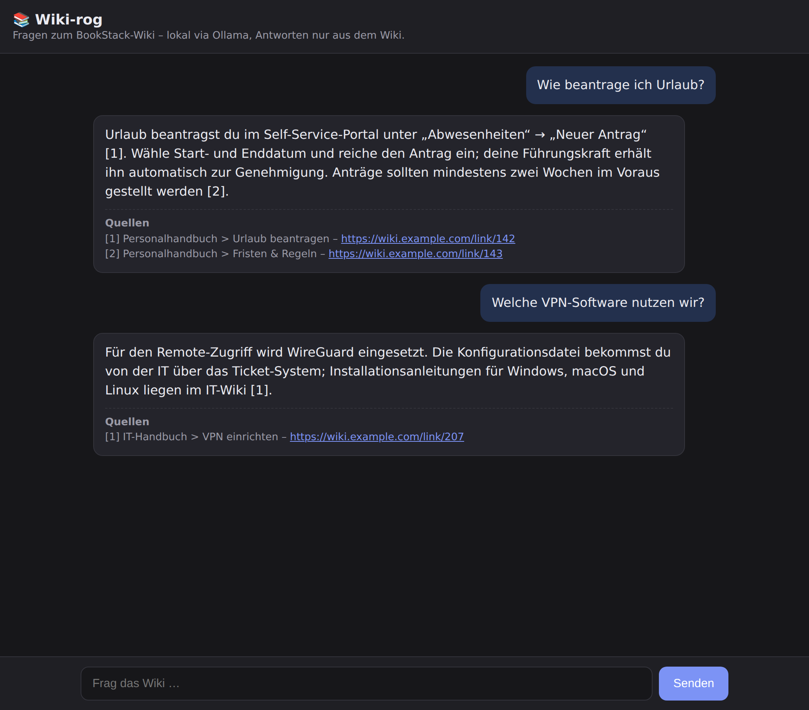
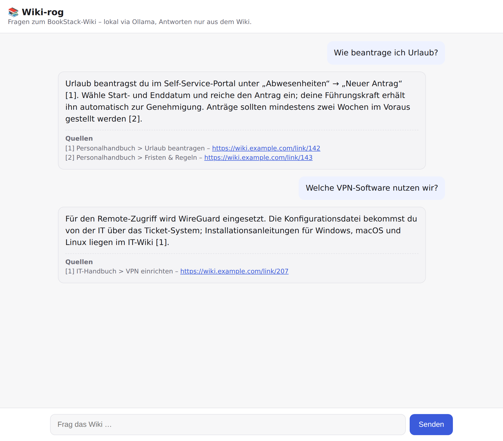
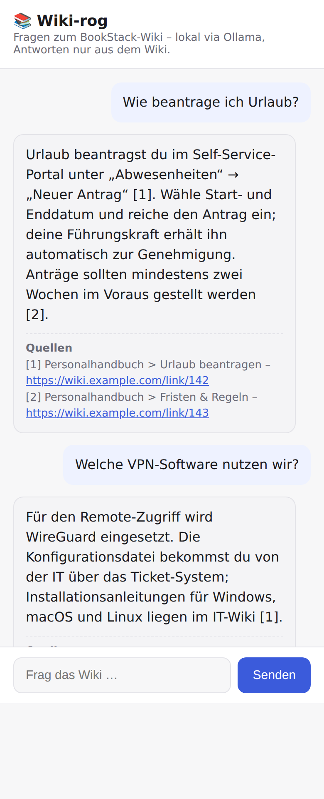
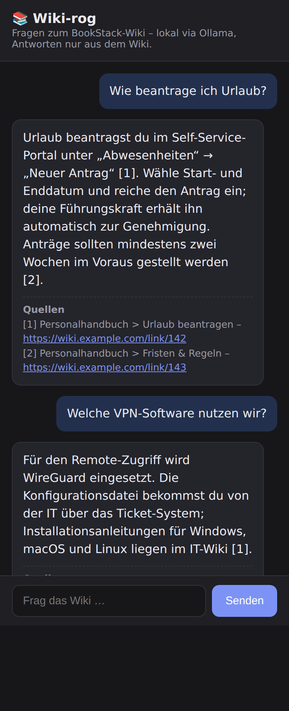

# 📚 Wiki-rog

Ein **lokales RAG-System** (Retrieval-Augmented Generation) in **Go**, das
ausschließlich das Wissen aus einem **externen BookStack-Wiki** nutzt. Antworten
und Embeddings laufen lokal über [Ollama](https://ollama.com) – es verlassen
keine Daten den Server (außer den API-Aufrufen an dein eigenes Wiki).

- **Sprache:** Go (nur Standardbibliothek, keine externen Module)
- **Datenquelle:** BookStack REST-API (nur diese Inhalte werden „gelernt")
- **Embeddings & LLM:** lokal via Ollama (kleines CPU-Modell, kein GPU nötig)
- **Vektorspeicher:** umschaltbar – **`local`** (eingebettet, pure Go) oder **`qdrant`**
- **Antworten:** strikt nur aus dem abgerufenen Wiki-Kontext – sonst
  „Das steht nicht im Wiki."

```
BookStack ──REST──> Ingest ──Chunks──> Embeddings (Ollama) ──> Vektorspeicher
                                                                     │
Frage ──> Embedding ──> Ähnlichkeitssuche ──> Kontext ──> LLM (Ollama) ──> Antwort + Quellen
```

## Screenshots

Die Web-UI (`wiki-rog serve`) – schlichter Chat, Antworten mit Quellenangaben,
Hell-/Dunkelmodus je nach System, responsiv bis Smartphone-Breite.

| Desktop (dunkel) | Desktop (hell) |
|---|---|
|  |  |

| Mobil (hell) | Mobil (dunkel) |
|---|---|
|  |  |

## Warum „lernt" es nur BookStack-Daten?

Das Modell wird **nicht** trainiert. Bei jeder Frage wird relevanter Text aus dem
Wiki gesucht und dem LLM als Kontext mitgegeben. Der System-Prompt zwingt das
Modell, **nur** aus diesem Kontext zu antworten und kein Weltwissen zu verwenden.
So bleibt die Wissensbasis exakt auf BookStack beschränkt und ist jederzeit
aktuell (einfach neu indexieren).

## Voraussetzungen

1. **Go 1.24+** (zum Bauen)
2. **Ollama** installiert und gestartet (`ollama serve`), mit den Modellen:
   ```bash
   ollama pull llama3.2:1b       # kleines, CPU-taugliches Antwort-Modell
   ollama pull nomic-embed-text  # Embedding-Modell
   ```
3. Eine erreichbare **BookStack-Instanz** (extern) mit API-Token
   (BookStack → *Profil bearbeiten* → *API-Tokens*).

## Bauen & Nutzen (lokal)

```bash
cp .env.example .env      # BookStack-URL + Token eintragen
go build -o wiki-rog ./cmd/wiki-rog

./wiki-rog test           # Verbindungen prüfen (BookStack + Ollama)
./wiki-rog ingest         # Wiki indexieren (inkrementell)
./wiki-rog ingest --reset # kompletter Neuaufbau
./wiki-rog ask "Wie beantrage ich Urlaub?"
./wiki-rog chat           # interaktiver Chat im Terminal
./wiki-rog serve          # Web-UI auf http://localhost:8080
```

Tests:
```bash
go test ./...
```

## Vektorspeicher: `local` oder `qdrant`

Umschaltbar über `VECTOR_BACKEND`:

- **`local`** (Standard) – eingebettet, pure Go. Speichert Embeddings in einer
  Datei unter `STORE_DIR` und sucht per In-Memory-Cosine-Ähnlichkeit. Kein
  zusätzlicher Dienst, ideal für Wiki-Größen (tausende Chunks).
- **`qdrant`** – nutzt einen externen [Qdrant](https://qdrant.tech)-Dienst über
  HTTP (`QDRANT_URL`). Skaliert besser für sehr große Wikis.

Nach einem Backend-Wechsel einmal `ingest --reset` ausführen.

## Konfiguration (`.env` bzw. Umgebungsvariablen)

| Variable | Bedeutung | Default |
|---|---|---|
| `BOOKSTACK_URL` | Basis-URL des externen Wikis | – |
| `BOOKSTACK_TOKEN_ID` / `BOOKSTACK_TOKEN_SECRET` | API-Token | – |
| `BOOKSTACK_BOOK_IDS` / `BOOKSTACK_SHELF_IDS` | Filter (kommagetrennt) | alle |
| `BOOKSTACK_VERIFY_SSL` | TLS-Prüfung des Wikis | `true` |
| `OLLAMA_URL` | Ollama-Endpoint | `http://localhost:11434` |
| `OLLAMA_LLM_MODEL` | Antwort-Modell | `llama3.2:1b` |
| `OLLAMA_EMBED_MODEL` | Embedding-Modell | `nomic-embed-text` |
| `VECTOR_BACKEND` | `local` oder `qdrant` | `local` |
| `VECTOR_COLLECTION` | Name der Collection/Datei | `bookstack` |
| `STORE_DIR` | Speicherort (Backend `local`) | `./data/store` |
| `QDRANT_URL` / `QDRANT_API_KEY` | Qdrant-Endpoint (Backend `qdrant`) | `http://qdrant:6333` |
| `CHUNK_SIZE` / `CHUNK_OVERLAP` | Chunk-Größe/Überlappung (Zeichen) | `1000` / `150` |
| `RETRIEVAL_TOP_K` | Anzahl Kontext-Chunks je Frage | `5` |
| `RETRIEVAL_MAX_DISTANCE` | max. Cosine-Distanz für Treffer | `1.0` |
| `HTTP_ADDR` | Adresse der Web-UI (`serve`) | `:8080` |

Private CA: `SSL_CERT_FILE` auf das CA-Bundle setzen (Go liest diese Variable).

## Deployment auf Kubernetes

Der komplette Stack (Ollama mit kleinem CPU-Modell, Web-UI, Ingest) läuft im
Cluster – **ohne GPU**. Das BookStack-Wiki bleibt **extern**. Manifeste: `k8s/`.

**1) Image bauen und dem Cluster verfügbar machen**
```bash
docker build -t wiki-rog:latest .

# Beispiel minikube:      minikube image load wiki-rog:latest
# Beispiel kind:          kind load docker-image wiki-rog:latest
# Registry (Produktion):  docker tag wiki-rog:latest <registry>/wiki-rog:latest
#                         docker push <registry>/wiki-rog:latest
#     (dann image: in k8s/app.yaml & k8s/ingest-job.yaml anpassen)
```

**2) Konfiguration & Secret setzen**
```bash
# BOOKSTACK_URL usw. in k8s/configmap.yaml anpassen
cp k8s/secret.example.yaml k8s/secret.yaml   # echte Token eintragen (gitignored)
```

**3) Ausrollen**
```bash
kubectl apply -f k8s/namespace.yaml
kubectl apply -f k8s/secret.yaml
kubectl apply -k k8s/                        # Ollama, App, Ingest-Job, Modell-Pull

kubectl -n wiki-rog wait --for=condition=complete job/ollama-pull-models --timeout=1200s
kubectl -n wiki-rog rollout status deploy/wiki-rog-app
```

**4) Web-UI öffnen**
```bash
kubectl -n wiki-rog port-forward svc/wiki-rog-app 8080:80
# -> http://localhost:8080
```

**Optional**
- `kubectl apply -f k8s/ingress.yaml` – Ingress (host/ingressClassName anpassen)
- `kubectl apply -f k8s/ingest-cronjob.yaml` – tägliche Auto-Aktualisierung
- `kubectl apply -f k8s/networkpolicy.yaml` – Egress zum externen Wiki (bei Default-Deny)
- `kubectl apply -f k8s/qdrant.yaml` – Qdrant-Backend (danach `VECTOR_BACKEND=qdrant`)

**Kleines CPU-Modell:** Standard ist `llama3.2:1b` (~1,3 GB) + `nomic-embed-text`.
Andere Modelle in `k8s/configmap.yaml` (`OLLAMA_LLM_MODEL`) setzen und den
`ollama-pull-models`-Job erneut ausführen. Für Ollama sind bewusst **keine**
GPU-Ressourcen angefordert – reiner CPU-Betrieb.

### Externes Wiki (außerhalb des Clusters)

Das BookStack-Wiki wird **nicht** im Cluster betrieben. Benötigt wird nur die
externe URL (`BOOKSTACK_URL`) + Token (`wiki-rog-secret`). Der Ingest-Job holt
die Inhalte per HTTPS live von dort.

- **Egress:** Ingest-Job/App müssen nach außen (Port 443) dürfen. Bei
  Default-Deny: `kubectl apply -f k8s/networkpolicy.yaml`. Liegt das Wiki in
  einem **privaten Netz**, den `except`-Block der Policy anpassen.
- **Öffentliches Zertifikat:** funktioniert ohne weitere Einstellungen.
- **Private CA:** CA als ConfigMap mounten und `SSL_CERT_FILE` setzen.
- **Self-signed (Notlösung):** `BOOKSTACK_VERIFY_SSL: "false"`.

Verbindungstest aus dem Cluster:
```bash
kubectl -n wiki-rog run bs-test --rm -it --restart=Never \
  --image=wiki-rog:latest --command -- /app/wiki-rog test
```

## Projektstruktur

```
Wiki-rog/
├── cmd/wiki-rog/main.go       # CLI: test / ingest / ask / chat / serve
├── internal/
│   ├── config/                # Konfiguration aus Umgebung/.env
│   ├── bookstack/             # BookStack REST-API-Client
│   ├── chunk/                 # Text-Chunking (+ Tests)
│   ├── ollama/                # Ollama (Embeddings + Chat, Streaming)
│   ├── store/                 # Vektorspeicher: Interface + local + qdrant (+ Tests)
│   ├── rag/                   # Retrieval + Antwortgenerierung
│   ├── ingest/               # Pipeline: fetch → chunk → embed → store
│   └── webui/                 # HTTP-Server + eingebettete Chat-UI (SSE)
├── go.mod
├── Dockerfile                 # Multi-Stage Go-Build (distroless)
├── .env.example
└── k8s/                       # Kubernetes-Manifeste
    ├── kustomization.yaml
    ├── namespace.yaml
    ├── configmap.yaml         # Konfiguration + Backend-/Modellwahl
    ├── secret.example.yaml    # Vorlage für BookStack-Token
    ├── storage.yaml           # PVC für local-Backend
    ├── ollama.yaml            # Ollama-Deployment (CPU-only) + Service + PVC
    ├── ollama-pull-job.yaml   # lädt die Modelle in Ollama
    ├── app.yaml               # Web-UI Deployment + Service
    ├── ingest-job.yaml        # einmaliger Ingest
    ├── ingest-cronjob.yaml    # optionale Auto-Aktualisierung
    ├── qdrant.yaml            # optionales Qdrant-Backend
    ├── networkpolicy.yaml     # optionaler Egress zum externen Wiki
    └── ingress.yaml           # optionaler Ingress
```

## Hinweise

- **Datenschutz:** LLM und Embeddings laufen lokal über Ollama; nur die
  BookStack-API wird kontaktiert. Nichts geht an externe Cloud-Dienste.
- **Aktualität:** Nach Änderungen im Wiki einfach `wiki-rog ingest` ausführen –
  geänderte Seiten werden neu eingelesen.
- **Embedding-Modell gewechselt?** Danach `ingest --reset` ausführen.
